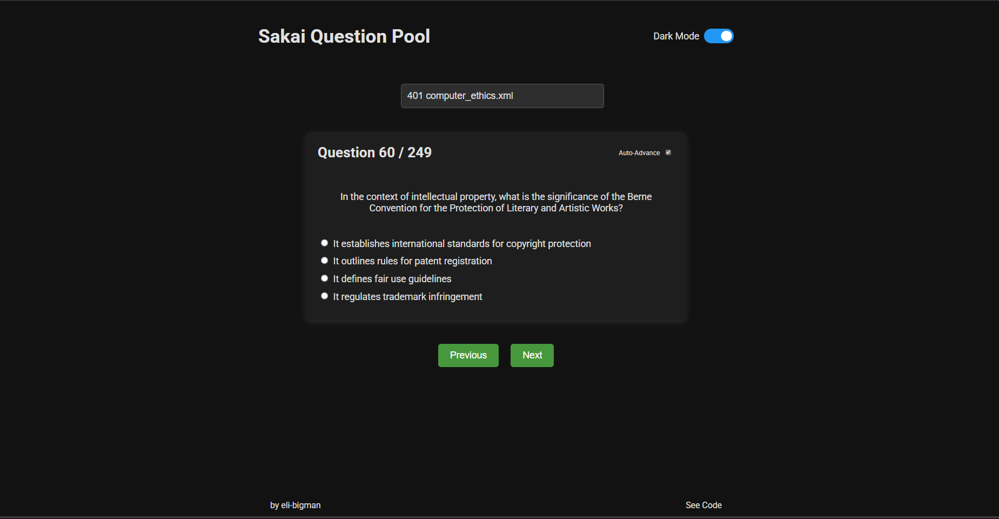

# Sakai Question Pool

**Sakai Question Pool** is a modern, mobile-friendly web application designed for practicing exam questions extracted directly from the Sakai Question Pool. This project represents the Sakai Question Pool's questions in a readable and interactive manner. The app loads question pools from QTI-style XML files and presents them with interactive UI features like sliding cards, a real-time searchable dropdown for question pools, and an iPhone-style dark mode toggle.

## Features

- **Dynamic Question Pools:**  
  Load and parse QTI XML files stored in the `public/xml_files` directory.  
  The manifest is generated automatically, so any new XML files are immediately available.

- **Sakai-Derived Content:**  
  The questions are sourced directly from the Sakai Question Pool. This app simply represents them in an accessible, user-friendly format without modifying the original content.

- **Multiple Question Types:**  
  Supports multiple choice, fill-in-the-blank, true/false, and essay questions.  
  Provides instant feedback when an answer is submitted, with correct answers highlighted in green and incorrect feedback in red.

- **Smooth Animations:**  
  Uses sliding card animations to transition between questions for a modern, engaging user experience.

- **Real-Time Searchable Dropdown:**  
  Easily filter and select question pools with a custom searchable dropdown.

- **Dark Mode Toggle:**  
  Switch between light and dark themes using an iPhone-style toggle.

- **Responsive Design:**  
  Mobile-friendly layout with a responsive footer that adapts from a two-column layout on desktop to a stacked layout on mobile.

## Demo

Check out the live app [here](https://sakai-question-pool.vercel.app).

